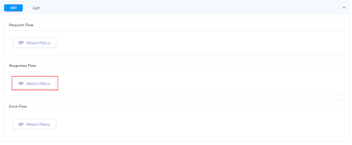
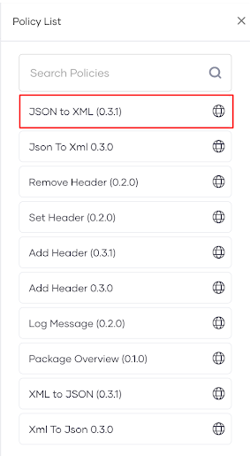
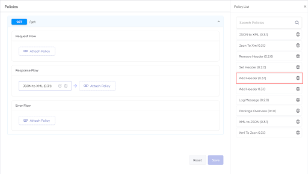
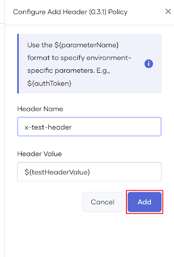

# Policies

Policies are units of business logic that a user can apply to slightly change the  `Request`, `Response`, or `Error` flow of an API invocation before reaching the backend or the client. For example, you can modify the response of an API invocation by adding a policy to the Response flow to transform the payload from JSON to  XML and to add a header in the response. 

Choreo includes a default set of policies covering most of the common use cases. You can attach one or more policies to the component implementation easily through the Choreo Console. Furthermore, you can attach multiple policies, swap, and rearrange them conveniently.

In Choreo, once you attach a mediation policy to a proxy, the deployment, internally, is a two-step process.

1. Deployment initiation 
   If the component to which you attached the mediation policy is new, the system creates and commits a new repository with the mediation service code based on the attached policies. This new service is referred to as the interceptor application. 

2. Deploying the API
    Once the deployment initiation is complete, you can provide any configurations required and proceed to deploy. In this step, Choreo builds the generated interceptor application and pushes the Docker image to the Docker registry. Finally, Choreo deploys the interceptor application with the mediation service and the API Proxy.

 Depending on the flow to which the mediation policy is attached, the API invocation will undergo the respective behavioral modification as follows: 
 
 

 - In the request path, the requests that pass through the gateway reach the relevant component, and Choreo executes any attached policies to the resource's request path before sending it to the backend. 

- In the response path, the response messages from the backend are first received by the interceptor component, and Choreo executes any mediation policies attached to the `Response` flow or the `Error` flow. Then the response is forwarded to the client.

- In the event an error occurrs during the execution of policies or due to an internal error, the `Error` flow is executed and an error response is sent to the client.

## Attach a policy

You can attach a policy to the `Request`, `Response`, or `Error` flow of the  REST API Proxy as follows:

1. Sign in to the Choreo Console at [https://console.choreo.dev](https://console.choreo.dev).
2. From the component list, select and click on the REST API Proxy component to which you want to attach the policy(s).
3. In the left navigation menu, click **Develop**  and then click **Policies**.
4. From the list of resources, expand the resource to which you want to attach the policy(s). 
5. Click Attach Policy for the relevant flow (i.e., `Request`, `Response`, or `Error`) to which you want to attach the policy.

   

6. From the **Policy List** panel on the right-hand side, select the policy you want to apply and click **Add**.

   

7. Click **Save**.

## Configuring the policy to accept environment-specific parameters

You can use policies that enable users to enter custom parameters and values. For example, Add Header policy requires the user to enter a header name and value when deploying the REST API Proxy. These parameters can be static values or environment-specific values. 

To add environment-specific values and policy parameters, follow the steps given below::

1. Sign in to the Choreo Console at [https://console.choreo.dev](https://console.choreo.dev).
2. From the component list, select and click on the REST API Proxy component to which you want to attach policies.
3. In the left navigation menu, click **Develop**  and then click **Policies**.
4. From the list of resources, expand the resource to which you want to attach the policy(s).
5. Click Attach Policy for the relevant flow (i.e., `Request`, `Response`, or `Error`) to which you want to attach the policy.
6. Add a policy that enables you to accept custom parameters and values from users. For example, the **Add Header** policy. 

       {.cInlineImage-full}

8. Enter values for the required policy parameters when prompted. If you want to make a parameter a configurable, enter the value in `${<variableName>}` format.For example, `${name}`.

       

9. Click **Add** and then click **Save**.
10. To deploy the component, from the left navigation menu, click **Deploy** and then click **Config & Deploy**. When the interceptor application generation step is complete, you can provide the configurations. 
11. When prompted, provide the value and click **Save & Deploy**.

     {.cInlineImage-full}

## Monitoring and troubleshooting the deployment

You can check logs at each stage of the deployment in the console that opens on the right of the page. To open this console, click on a build from the **Build and Deployment History** in the **Build Area**.

#### Code Generation

This is the stage where the interceptor application is generated based on the mediation policies. In this stage, if there are any errors, the user can view them in the console. If the error is due to a user error, for example, an error related to the API definition, etc., based on the logs the user can fix the issue and retrigger a build.

#### Build

The build stage builds the interceptor application as a Docker image and deploys it in the respective environment. For logs related to the build, you can refer build logs of both Ballerina and Docker. 

Any errors that occur in this stage are not due to user error. If an error occurs, you need to retry the deployment.
